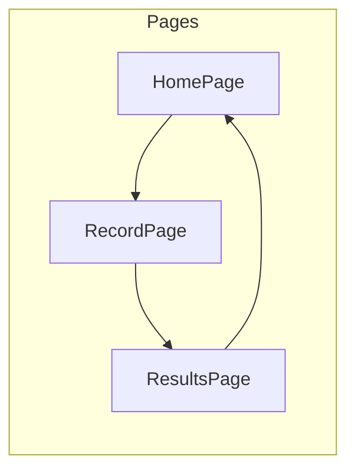
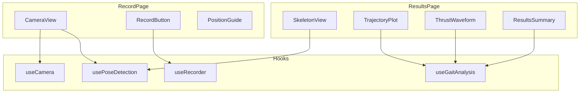

# GaitKnee-View ディレクトリ構成 & コンポーネント設計

## 1. ディレクトリ構成

```
GaitKnee-View/
├── docs/                          # ドキュメント
│   ├── requirements.md            # 要件定義書
│   ├── wireframes.md              # ワイヤーフレーム
│   └── component-design.md        # 本ドキュメント
│
├── public/                        # 静的ファイル
│   └── models/                    # MediaPipeモデルファイル
│       └── pose_landmarker.task
│
├── src/
│   ├── components/                # UIコンポーネント
│   │   ├── common/               # 共通コンポーネント
│   │   │   ├── Button.tsx
│   │   │   ├── Card.tsx
│   │   │   └── Header.tsx
│   │   │
│   │   ├── camera/               # カメラ関連
│   │   │   ├── CameraView.tsx        # カメラプレビュー
│   │   │   ├── RecordButton.tsx      # 録画ボタン
│   │   │   └── PositionGuide.tsx     # 位置決めガイド
│   │   │
│   │   ├── visualization/        # 可視化
│   │   │   ├── SkeletonView.tsx      # スケルトン描画
│   │   │   ├── TrajectoryPlot.tsx    # 膝軌跡プロット
│   │   │   └── ThrustWaveform.tsx    # 波形グラフ
│   │   │
│   │   └── results/              # 結果表示
│   │       ├── ResultsSummary.tsx    # サマリーカード
│   │       └── ReportCard.tsx        # レポート
│   │
│   ├── hooks/                    # カスタムフック
│   │   ├── useCamera.ts              # カメラ制御
│   │   ├── usePoseDetection.ts       # MediaPipe姿勢推定
│   │   ├── useGaitAnalysis.ts        # 歩行分析
│   │   └── useRecorder.ts            # 録画制御
│   │
│   ├── lib/                      # ユーティリティ
│   │   ├── mediapipe.ts              # MediaPipe初期化
│   │   ├── gaitCycle.ts              # 歩行周期検出
│   │   ├── lateralThrust.ts          # Lateral Thrust計算
│   │   └── export.ts                 # PNG/JSONエクスポート
│   │
│   ├── pages/                    # ページコンポーネント
│   │   ├── HomePage.tsx
│   │   ├── RecordPage.tsx
│   │   └── ResultsPage.tsx
│   │
│   ├── types/                    # 型定義
│   │   ├── pose.ts                   # 姿勢データ型
│   │   ├── gait.ts                   # 歩行分析型
│   │   └── session.ts                # セッション型
│   │
│   ├── styles/                   # スタイル
│   │   ├── global.css
│   │   ├── variables.css             # CSS変数
│   │   └── components/               # コンポーネント別CSS
│   │
│   ├── App.tsx                   # ルートコンポーネント
│   └── main.tsx                  # エントリーポイント
│
├── index.html
├── package.json
├── tsconfig.json
└── vite.config.ts
```

---

## 2. 主要コンポーネント設計

### 2.1 ページ構成



---

### 2.2 コンポーネント依存関係



---

## 3. 主要Hook仕様

### useCamera
```typescript
function useCamera(): {
  videoRef: RefObject<HTMLVideoElement>;
  stream: MediaStream | null;
  isReady: boolean;
  error: Error | null;
  switchCamera: () => Promise<void>;  // 前面/背面切替
  facingMode: 'user' | 'environment';
}
```

### usePoseDetection
```typescript
function usePoseDetection(videoRef: RefObject<HTMLVideoElement>): {
  landmarks: PoseLandmark[] | null;  // 33点のランドマーク
  worldLandmarks: PoseLandmark[] | null;  // 3D座標
  isProcessing: boolean;
  fps: number;
}
```

### useGaitAnalysis
```typescript
function useGaitAnalysis(frames: FrameData[]): {
  stancePhases: StancePhase[];      // stance期検出結果
  lateralThrust: LateralThrustData; // lateral thrust計算結果
  leftLeg: LegAnalysis;
  rightLeg: LegAnalysis;
}
```

### useRecorder
```typescript
function useRecorder(): {
  isRecording: boolean;
  duration: number;              // 録画時間（秒）
  frames: FrameData[];          // 録画フレーム
  startRecording: () => void;
  stopRecording: () => FrameData[];
}
```

---

## 4. 主要データ型

```typescript
// 姿勢ランドマーク
interface PoseLandmark {
  x: number;  // 0-1 正規化座標
  y: number;
  z: number;  // 深度
  visibility: number;
}

// フレームデータ
interface FrameData {
  timestamp: number;
  landmarks: PoseLandmark[];
  worldLandmarks: PoseLandmark[];
}

// Lateral Thrust結果
interface LateralThrustData {
  leftKnee: ThrustMetrics;
  rightKnee: ThrustMetrics;
  asymmetryPercent: number;  // 左右差%
}

interface ThrustMetrics {
  amplitude: number;         // 振幅
  maxDisplacement: number;   // 最大変位
  waveform: number[];        // 時系列データ
  severity: 'low' | 'moderate' | 'high';
}

// 歩行周期
interface StancePhase {
  leg: 'left' | 'right';
  startFrame: number;
  endFrame: number;
}
```

---

## 5. MediaPipe統合

```typescript
// lib/mediapipe.ts
import { PoseLandmarker, FilesetResolver } from '@mediapipe/tasks-vision';

export async function initPoseLandmarker(): Promise<PoseLandmarker> {
  const vision = await FilesetResolver.forVisionTasks(
    'https://cdn.jsdelivr.net/npm/@mediapipe/tasks-vision/wasm'
  );
  
  return PoseLandmarker.createFromOptions(vision, {
    baseOptions: {
      modelAssetPath: '/models/pose_landmarker.task',
      delegate: 'GPU'  // GPU使用で高速化
    },
    runningMode: 'VIDEO',
    numPoses: 1
  });
}
```

---

## 6. Lateral Thrust計算ロジック

```typescript
// lib/lateralThrust.ts
export function calculateLateralThrust(
  frames: FrameData[],
  stancePhases: StancePhase[]
): LateralThrustData {
  // 1. 各stance期ごとにknee_x - ankle_xを計算
  // 2. 最大振幅（max - min）を算出
  // 3. 左右別に集計
  // 4. 左右差を計算
}
```

---

## 7. 技術選定理由

| 技術 | 選定理由 |
|------|----------|
| Vite | 高速な開発サーバー、モバイル対応良好 |
| TypeScript | 型安全性でバグ防止 |
| MediaPipe Tasks | WASM版でブラウザ完結、スマホ対応 |
| CSS Modules | スコープ付きCSS、軽量 |

---

## 次のステップ
→ プロジェクト初期化 & MVP実装開始
