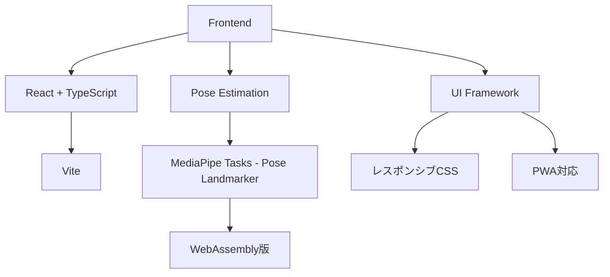
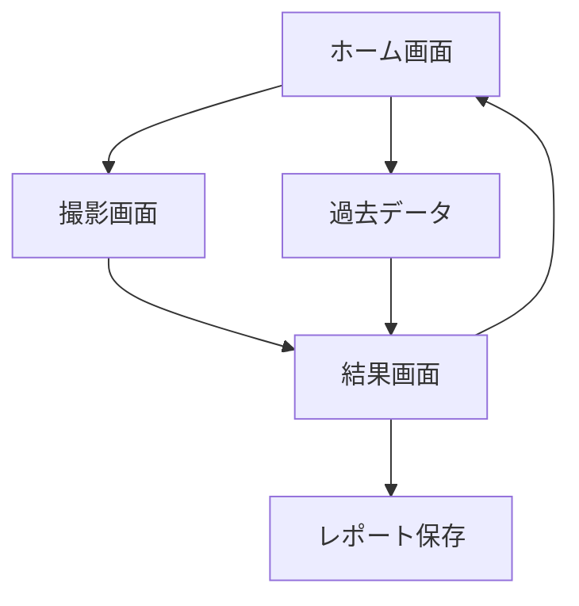

# GaitKnee-View 要件定義書
## MediaPipeを使用した膝関節 Lateral Thrust 可視化Webアプリ

---

## 1. システム概要

### 1.1 システム名（仮）
**GaitKnee-View** – MediaPipeを使用した膝関節 lateral thrust 可視化Webアプリ

### 1.2 目的
- 歩行時の膝関節の横方向ブレ（lateral thrust）を**臨床家が直感的に把握**できるようにする
- セラピストと患者が**一緒に画面を見ながら説明できる**ツールを提供
- 研究用の精密モーションキャプチャではなく、**日常臨床レベルで使える簡易評価ツール**がゴール

### 1.3 想定ユーザー
| ユーザー | 利用目的 |
|----------|----------|
| 理学療法士 / 作業療法士 | 膝OA患者の歩行評価 |
| トレーナー | アスリートの動作分析 |
| 整形外科クリニック・通所リハスタッフ | 経過フォロー |
| 研究者 | 予備評価ツールとしての利用 |

### 1.4 利用シーン
- 外来リハ室・通所リハでの歩行評価（膝OAなど）
- 初回評価時、経過フォローでの**比較（初回 vs 1ヶ月後）**
- 患者教育用の「見せる資料」として

---

## 2. 対応プラットフォーム / 環境

### 2.1 クライアント環境

| プラットフォーム | 対応状況 | 詳細 |
|------------------|----------|------|
| **PC ブラウザ** | ✅ Primary | Chrome推奨、Safari/Firefox対応 |
| **スマートフォン** | ✅ Primary | iOS Safari、Android Chrome |
| **タブレット** | ✅ Secondary | iPad、Android タブレット |

> [!IMPORTANT]
> **スマホ対応が主要要件** - リハビリ現場での即時撮影・確認を重視

### 2.2 カメラ要件

| デバイス | カメラ種別 | 推奨解像度 |
|----------|------------|------------|
| PC | USB Webカメラ / 内蔵カメラ | 720p以上 |
| スマートフォン | 背面カメラ（推奨）/ 前面カメラ | 720p以上 |
| タブレット | 背面カメラ（推奨） | 720p以上 |

### 2.3 技術スタック



| レイヤー | 技術選択 | 備考 |
|----------|----------|------|
| Frontend | React + TypeScript + Vite | モダンで高速 |
| Pose推定 | MediaPipe Tasks – Pose Landmarker (WASM) | ブラウザ内完結 |
| スタイリング | CSS Modules / Vanilla CSS | レスポンシブ対応 |
| バックエンド | なし（Phase 1） | 完全フロントのみ |
| データ保存 | IndexedDB / LocalStorage | ローカル保存 |

---

## 3. 撮影条件

### 3.1 歩行形態
- **平地歩行**（10m 程度の直線歩行）
- **速度**: 自然歩行速度（comfortable speed）

### 3.2 カメラ配置（Lateral Thrust 重視）

```
        ┌─────────────────────────────────┐
        │         歩行路                   │
        │  ◄─────────────────────────────► │
        │         10m 直線                 │
        └─────────────────────────────────┘
                       │
                       │ 3〜5m
                       ▼
                    📱/📷
              正面 or 背面から撮影
```

| 項目 | 推奨値 |
|------|--------|
| 撮影方向 | **正面 or 背面**（フロント面評価） |
| 被写体距離 | 3〜5m |
| フレーム内要件 | 両ASIS〜足部が収まること |
| 撮影時間 | 1クリップ 5〜15秒 |

### 3.3 スマホ撮影時のガイダンス
- **横向き（ランドスケープ）推奨**
- 三脚・固定台の使用推奨
- 手持ち撮影の場合は安定させるガイド表示

---

## 4. 機能要件（Functional Requirements）

### F-01: 歩行動画の取得

| 要件ID | 内容 | 優先度 |
|--------|------|--------|
| F-01-1 | Webカメラ/スマホカメラからリアルタイム動画ストリーム取得 | Must |
| F-01-2 | 「録画開始」「録画停止」ボタン操作 | Must |
| F-01-3 | 1クリップ 5〜15秒程度の録画 | Must |
| F-01-4 | スマホでの前面/背面カメラ切替 | Should |
| F-01-5 | 録画済み動画ファイルのアップロード | Should |

---

### F-02: MediaPipeによる関節ランドマーク推定

| 要件ID | 内容 | 優先度 |
|--------|------|--------|
| F-02-1 | MediaPipe Pose Landmarkerによる骨格推定 | Must |
| F-02-2 | 対象ランドマーク: 腰(hip)、膝(knee)、足首(ankle) | Must |
| F-02-3 | 3D位置（カメラ座標系）のフレーム毎取得 | Must |
| F-02-4 | 推定信頼度スコアの取得 | Should |

---

### F-03: フロント面への射影と座標系定義

| 要件ID | 内容 | 優先度 |
|--------|------|--------|
| F-03-1 | フロント面（前額面）2D座標系の定義 | Must |
| F-03-2 | x軸: 左右方向（lateral）、y軸: 上下方向（vertical） | Must |
| F-03-3 | 3D座標からフロント面2Dへの射影計算 | Must |

---

### F-04: 歩行周期の分割

| 要件ID | 内容 | 優先度 |
|--------|------|--------|
| F-04-1 | stance期・swing期のざっくり判定 | Must |
| F-04-2 | 膝or足首の鉛直方向速度・位置変化から判定 | Must |
| F-04-3 | 左右脚別のstance期識別 | Must |

---

### F-05: Lateral Thrust 指標の計算

> [!IMPORTANT]
> **今回のキモ** - 定性的 lateral thrust 指標の定義

#### 計算式
```
Lateral Thrust 指標 = knee_x - ankle_x の stance期内での変化量
                    = max(knee_x - ankle_x) - min(knee_x - ankle_x)
```

| 要件ID | 内容 | 優先度 |
|--------|------|--------|
| F-05-1 | stance期における knee_x - ankle_x の時間変化計算 | Must |
| F-05-2 | 最大変位量（max–min）の算出 | Must |
| F-05-3 | 1歩ごとの指標計算 | Must |
| F-05-4 | 左右脚別の指標算出 | Must |

---

### F-06: Lateral Thrust の可視化

#### 6.1 スティックフィギュア＋軌跡

| 要件ID | 内容 | 優先度 |
|--------|------|--------|
| F-06-1 | フロントビューで簡易骨格描画 | Must |
| F-06-2 | stance期の膝関節軌跡（x-y軸）ライン表示 | Must |
| F-06-3 | 横ブレ大→軌跡が左右に波打つ可視化 | Must |
| F-06-4 | 再生・一時停止・スロー再生機能 | Should |

#### 6.2 時間グラフ（波形表示）

| 要件ID | 内容 | 優先度 |
|--------|------|--------|
| F-06-5 | 横軸: 時間、縦軸: knee_x - ankle_x の波形表示 | Must |
| F-06-6 | 1歩毎の波形を重ね描き or 並べて表示 | Must |
| F-06-7 | 閾値超え部分を赤色ハイライト | Should |
| F-06-8 | ピンチズーム対応（スマホ） | Should |

---

### F-07: 片脚ごとの比較表示

| 要件ID | 内容 | 優先度 |
|--------|------|--------|
| F-07-1 | 右脚・左脚のlateral thrust波形を同スケール並列表示 | Must |
| F-07-2 | 左右差のパーセンテージ表示 | Should |

---

### F-08: セッション保存 & エクスポート

| 要件ID | 内容 | 優先度 |
|--------|------|--------|
| F-08-1 | 解析結果の静止画像（PNG）保存 | Must |
| F-08-2 | 数値データのJSONエクスポート | Should |
| F-08-3 | セッション履歴のローカル保存 | Should |
| F-08-4 | 共有用URL生成（将来） | Could |

---

### F-09: 簡易レポート生成

| 要件ID | 内容 | 優先度 |
|--------|------|--------|
| F-09-1 | 「右膝 lateral thrust: 振幅〇〇、左より大」等の自動コメント | Must |
| F-09-2 | 「左右差: ××%」の表示 | Should |
| F-09-3 | 定性評価（小・中・大）のバッジ表示（Phase2） | Could |

---

## 5. 非機能要件（Non-Functional Requirements）

### N-01: 処理速度

| 要件ID | 内容 | 目標値 |
|--------|------|--------|
| N-01-1 | 解析完了時間 | 録画終了〜結果表示 3〜5秒以内 |
| N-01-2 | Pose推定フレームレート | 15 FPS以上（環境依存） |
| N-01-3 | スマホでの推定速度 | 10 FPS以上 |

---

### N-02: 操作性

| 要件ID | 内容 |
|--------|------|
| N-02-1 | 1〜2クリックで録画→解析→結果確認 |
| N-02-2 | 操作説明なしで直感的に扱える |
| N-02-3 | スマホでの片手操作対応 |
| N-02-4 | 大きなタッチターゲット（44px以上） |

---

### N-03: プライバシー

| 要件ID | 内容 |
|--------|------|
| N-03-1 | 動画データはローカルのみ（クラウド送信なし） |
| N-03-2 | 保存データは骨格座標と解析結果（JSON）のみ |
| N-03-3 | 顔データはオプション保存 |
| N-03-4 | HTTPS通信必須（カメラアクセス要件） |

---

### N-04: 再現性

| 要件ID | 内容 |
|--------|------|
| N-04-1 | 同一環境での撮影で一貫した傾向 |
| N-04-2 | 比較分析に足る相対的な精度 |

---

### N-05: アクセシビリティ

| 要件ID | 内容 |
|--------|------|
| N-05-1 | 十分なコントラスト比（WCAG 2.1 AA準拠） |
| N-05-2 | ボタンの適切なサイズ |
| N-05-3 | 色覚多様性への配慮（色+形での識別） |

---

## 6. UI / 画面要件

### 6.1 画面構成



### 6.2 各画面の要件

#### ホーム画面
- 「新規撮影」ボタン（大きく目立つ）
- 「過去データ」ボタン
- 簡単な使い方ガイド（初回のみ）

#### 撮影画面
- ライブカメラプレビュー（全画面）
- 被写体位置ガイド（シルエット枠）
- 「録画開始/停止」大きなボタン
- カメラ切替ボタン（スマホ時）
- 「横向きにしてください」ガイド（縦向き検出時）

#### 結果画面
- **上部**: 歩行スティックフィギュア（再生可能）
- **中央**: 膝の軌跡（フロントビュー）
- **下部**: 左右別lateral thrust波形グラフ
- 数値サマリー表示
- 「保存」「やり直し」ボタン

### 6.3 レスポンシブ対応

| 画面サイズ | レイアウト |
|------------|------------|
| モバイル（〜768px） | 縦積みレイアウト、タッチ最適化 |
| タブレット（769〜1024px） | 2カラム可能 |
| デスクトップ（1025px〜） | 3カラム可能 |

---

## 7. 技術的制約・リスク

### 7.1 MediaPipe Pose の限界

| 制約 | 影響 | 対策 |
|------|------|------|
| 絶対位置精度が研究用より劣る | mm単位評価は困難 | 相対比較・左右差に焦点 |
| 服装・照明に影響されやすい | 推定ブレ | 撮影ガイダンス提供 |
| カメラ角度依存 | 一貫性低下 | 撮影条件標準化 |

### 7.2 スマホ特有の制約

| 制約 | 影響 | 対策 |
|------|------|------|
| 処理性能の差 | フレームレート低下 | 解像度自動調整 |
| バッテリー消費 | 長時間使用困難 | 省電力モード検討 |
| 手ブレ | 推定精度低下 | 三脚推奨ガイド |
| ブラウザ互換性 | 動作不安定 | Safari/Chrome重点テスト |

### 7.3 前提条件

> [!CAUTION]
> このツールは**精密モーションキャプチャの代替ではありません**
> - 「相対的な変化」「左右差」の観察に適しています
> - 絶対値としてのmm評価は困難です

---

## 8. 開発フェーズ

### Phase 1（MVP）- 4〜6週間

| 機能 | 詳細 |
|------|------|
| ✅ カメラ撮影 | PC/スマホ対応 |
| ✅ 骨格推定 | MediaPipe Pose Landmarker |
| ✅ Lateral Thrust可視化 | 波形＋軌跡表示 |
| ✅ PNG保存 | 静止画エクスポート |
| ✅ 左右比較 | 基本的な並列表示 |

### Phase 2 - 2〜4週間

| 機能 | 詳細 |
|------|------|
| 🔄 スコアリング | 小・中・大のバッジ表示 |
| 🔄 stance/swing精度向上 | より正確なイベント検出 |
| 🔄 JSON エクスポート | 研究用データ出力 |
| 🔄 PWA対応 | オフライン動作 |

### Phase 3 - 4〜6週間

| 機能 | 詳細 |
|------|------|
| 🔮 経時比較 | 初回 vs X日後の比較画面 |
| 🔮 パターン分類 | 正常/lateral thrust大等 |
| 🔮 多言語対応 | 英語対応 |

---

## 9. 検証計画

### 9.1 開発中の検証

| 検証項目 | 方法 |
|----------|------|
| カメラアクセス | PC Chrome、iOS Safari、Android Chromeで動作確認 |
| MediaPipe動作 | 各デバイスでのフレームレート計測 |
| レスポンシブUI | 各画面サイズでの表示確認 |
| 保存機能 | PNG/JSONが正しく出力されるか |

### 9.2 ユーザーテスト（リリース前）

| テスト | 内容 |
|--------|------|
| 操作性テスト | 理学療法士3名程度に操作してもらう |
| 撮影条件テスト | 異なる照明・距離での精度確認 |
| 結果解釈テスト | 出力が臨床的に妥当か確認 |

---

## 10. まとめ

| 項目 | 結論 |
|------|------|
| 実現可能性 | ✅ **十分現実的** |
| 主要ユースケース | 臨床での説明・Before/After比較 |
| スマホ対応 | ✅ **主要要件として対応** |
| 制限事項 | mm単位の精密評価は困難（相対比較に特化） |

> [!TIP]
> **設計のポイント**
> - 「精密モーションキャプチャ」ではなく「臨床説明ツール」として設計
> - スマホでの撮影〜確認がスムーズに行えることを重視
> - 左右差・Before/After比較に焦点を当てた可視化
